# PLM-Aerospace-Implementation
Implementation of Product Lifecycle Management (PLM) in Aerospace Industry with research paper, Teamcenter ITK server-side customization.

## ITK Programs Batch Utility Results

### 1) Login 

### 2) Item create (in home folder)

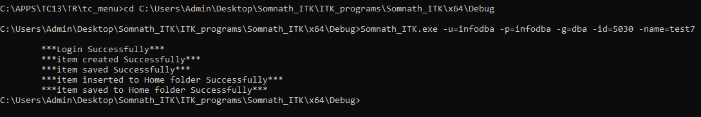

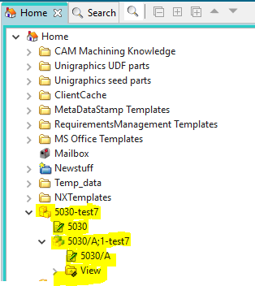

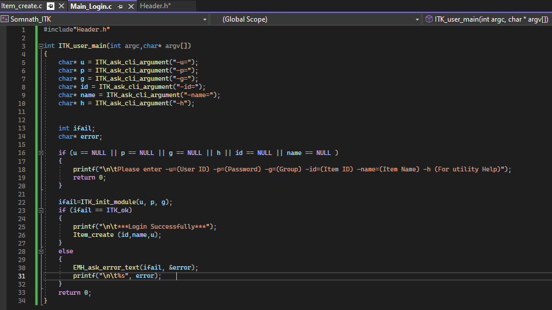

### 3) Create dataset and attach to item

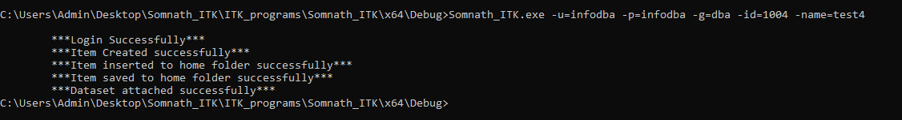

### 4) Item create using TCTYPE_create_object (in home folder)

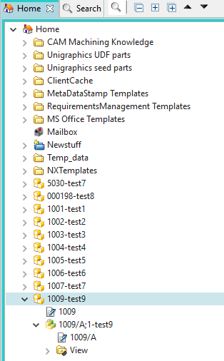

### 5) dataset export

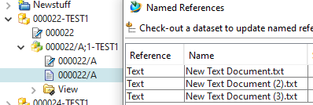

### 6) Query execute

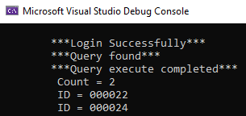

### 7) Find_objects_acc_criteria

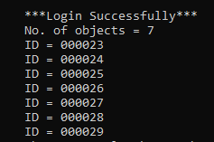

### 8) Bulk_item_create_through_csv

### 9) Import_dataset

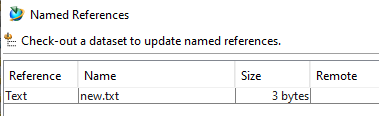

### 10) Find objects acc. criteria and export its named ref. datasets

### 11) Print_BOM_line_item_id (level 1 childs only)

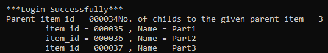

### 12) Print_BOM_line_item_id (Multi level childs)

### 13) Change Ownership

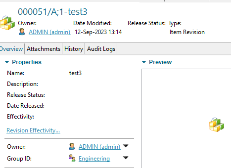

### 14) Create form and attach to BO

### 15) Bulk file import

